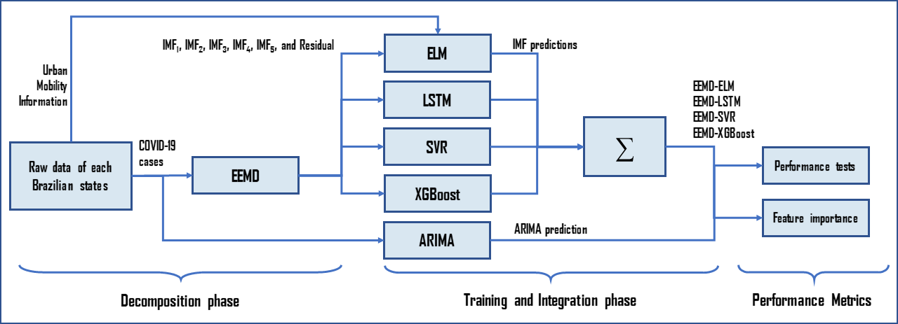

# Book chapter publication in [Modeling, Control and Drug Development for COVID-19 Outbreak Prevention (Springer)][Springer]
## :mask::car::cityscape: Ensemble learning models coupled with urban mobility information applied to predict COVID-19 incidence cases
[</img> Matheus H. D. M. Ribeiro][MatheusID], [</img> Ramon Gomes da Silva][RamonID], [</img> José Henrique Kleinübing Larcher][JoseID],  [</img> Viviana Cocco Mariani][VivianaID], [</img> Leandro dos Santos Coelho][LeandroID]



### Publication
- [Preprint (Researchgate)][RG]
- [Book Chapter (Springer)][Springer]

### How to cite this paper
```bibtex
@incollection{ribeiro2021springer,
  author = {Matheus Henrique Dal Molin Ribeiro and Ramon Gomes {da Silva} and Jos\'e Henrique Klein\"ubing Larcher and Viviana Cocco Mariani and Leandro Santos Coelho}, 
  title = {Ensemble learning models coupled with urban mobility information applied to predict {COVID-19} incidence cases},
  booktitle = {Modeling, Control and Drug Development for {COVID-19} Outbreak Prevention},
  publisher = {Springer International Publishing},
  year = {2021},
  editor = {Azar, Ahmad Taher and Hassanien, Aboul Ella},
  volume = {366},
  pages = {690},
  edition = {1},
  month = {Jan},
  address = {Heidelberg, Germany}
}
```
[JoseID]: https://orcid.org/0000-0001-8654-0312
[RamonID]: https://orcid.org/0000-0001-8580-7695
[MatheusID]: https://orcid.org/0000-0001-7387-9077
[VivianaID]: https://orcid.org/0000-0003-2490-4568
[LeandroID]: https://orcid.org/0000-0001-5728-943X
[RG]: https://www.researchgate.net/publication/349891360_Ensemble_learning_models_coupled_with_urban_mobility_information_applied_to_predict_COVID-19_incidence_cases
[Springer]: https://www.springer.com/gp/book/9783030728335
